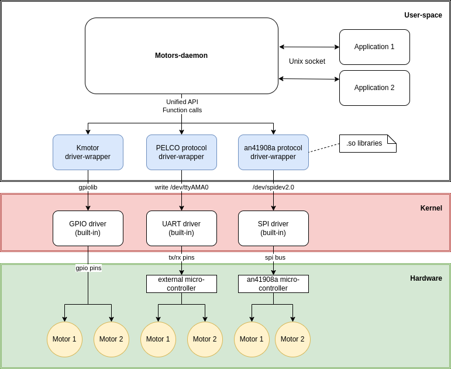

# Архитектура проекта Motorland

## То, что реализуем мы
### Userspace 
#### Демон
- Читает конфиг и загружает динамическую библиотеку для работы с мотором
- Вызывает инициализирую функцию библиотеки
- Создает unix-socket и слушает подключения и транслирует команды от других приложений
- Обеспечивает совместимость с различным железом, предоставляя единый интерфейс
- Может обеспечивать поддержку многопоточности для обработки запросов от нескольких приложений одновременно
- Может вести журнал работы 
#### Сторонние приложения
- Веб-приложение, использующее CGI-сценарии для взаимодействия с демоном.
- Пользовательские скрипты, написанные на Си или Bash (socat/nc), расширяющие стандартный функционал библиотек и демона. Позволяют добавлять автоматизации и действия по событиям.
#### Библиотека с стандартизированным API
- Предоставляет набор функций для работы с PTZF
- Управляет мотором через соответствующий драйвер (gpio/spi/i2c)
- Позволяет представлять любой мотор и его параметры через стандартный интерфейс 
- Может учитывать специфику взаимодействия с внешними микроконтроллерами (задержку, наличие обратной связи)
- Может поддерживать обратную связь от моторов, такую как датчики положения или концевики

## То, что используется “под капотом”
### Kernel
#### Драйверы i2c/spi/uart/gpio - предназначены для управления аппаратными интерфейсами встроенных систем. Взаимодействия с микроконтроллером или с мотором напрямую (через транзисторный массив)

### Hardware
#### Микроконтроллер мотора
- stc 8f2k32s2 
- 8-битный микроконтроллер, работает на частоте 32 МГц
- Запрограммирован производителем платы для управления моторами.
- Принимает команды от soc через UART в соответствии с протоколом PELCO
#### Драйвер (Транзисторные массивы Дарлингтона)
- BORN B**ULN2803**LVS
- Транзисторы на 5v
- Управление нагрузкой (шаговыми двигателями)
- Защита от обратной ЭДС
#### Шаговый двигатель
- Униполярный шаговый двигатель 28byj48
- имеет 4 фазы и 5 проводов
- 32 шага на оборот, для полного оборота необходимо выполнить 2038 шагов. 
- 28BYJ48 имеет шестеренчатый редуктор с отношением передачи 1:64 (1:63.68)
- Его диаметр составляет 28 мм, а длина - 19 мм.
работает при напряжении 5В
